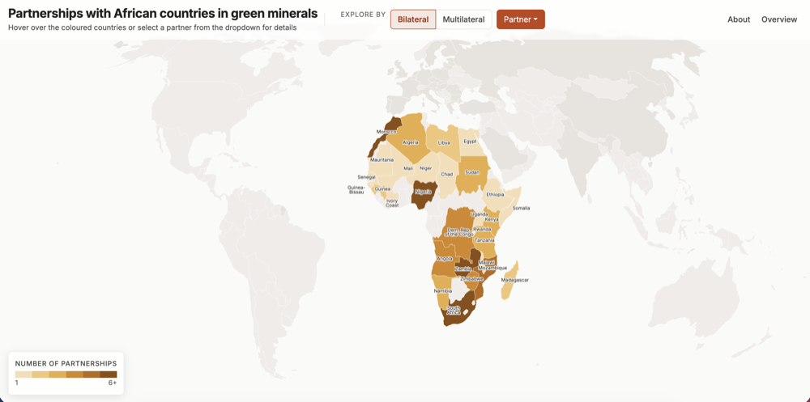
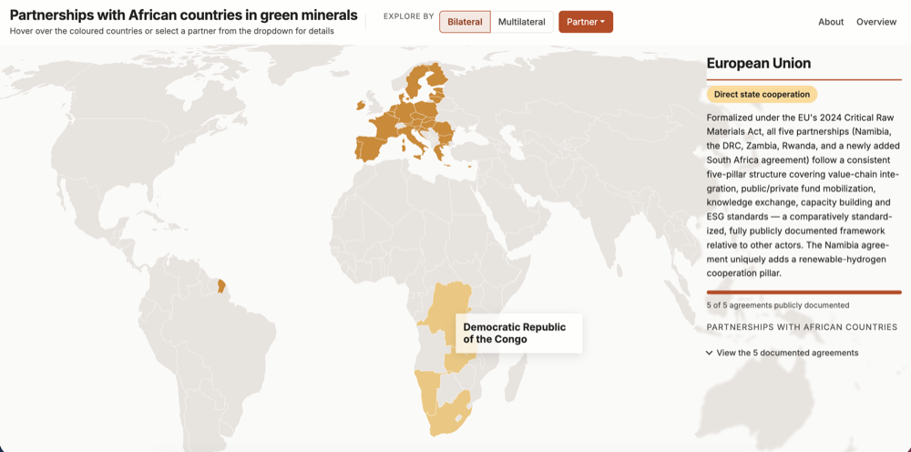
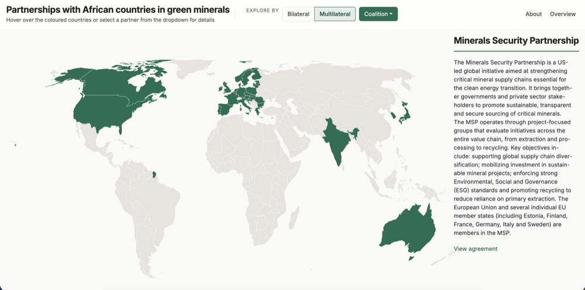
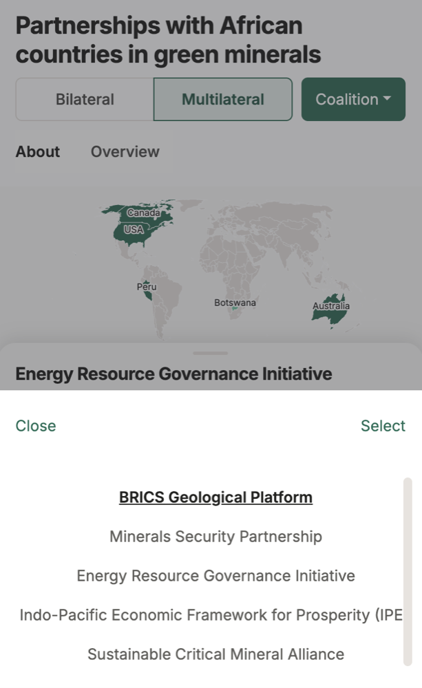

# Partnerships with African Countries in Green Minerals

An interactive map of the agreements that African countries have signed with international partners on access to critical, "green" minerals: who has signed with whom, since when, and in which areas of cooperation.

**[Live demo](https://mrosadio.github.io/map-green-minerals/)** · Visualization design and development: Micaela Rosadio · Data and research: [Africa Policy Research Institute (APRI)](https://afripoli.org), Geopolitics and Geoeconomics Program



## What it does

- **Bilateral view.** A choropleth shows how many partnerships each African country has. Choose a partner (a country or the EU) to see its agreements: signing date, access status and areas of cooperation.
- **Multilateral view.** Switch to coalitions such as the Minerals Security Partnership or the Lobito Corridor Project to see which countries each one covers.
- **Works on desktop, tablet and phone.** Desktop shows a side panel and hover tooltips. On tablets the details stack below the map. On phones, a native-style picker replaces the dropdowns and highlighted countries are labelled directly on the map, because there is no hover on touch.

| Partner detail | Multilateral | Phone |
| --- | --- | --- |
|  |  |  |

## Design and engineering decisions

- **Design tokens.** Colour, type, spacing, shadows, layers and motion live as CSS custom properties. Each mode (bilateral, multilateral) re-themes the interface through a single `data-mode` attribute. D3 reads the same tokens at draw time, so the map and the interface cannot drift apart.
- **Touch-first labelling.** Where hover is unavailable, highlighted countries get permanent labels. A small push-apart algorithm spreads overlapping labels and draws leader lines, and it never drops a highlighted country.
- **Accessibility.** Keyboard operation throughout, focus returned to the control that opened a dialog, background content made `inert` while a dialog is open, screen-reader labels on the map and legend, and a single heading hierarchy. Text contrast was checked against WCAG AA. Lighthouse accessibility score: 98.
- **No framework, no build-time magic.** Vanilla ES modules with D3 for the geography and Vite for the dev server and bundling. Bootstrap 5 supplies the grid and the dropdown and modal behaviour.

## Run it locally

```bash
npm install
npm run dev        # development server
npm run build      # production build into dist/
npm run preview    # serve the production build
```

Pushes to `main` are deployed to GitHub Pages by the workflow in `.github/workflows/deploy.yml`.

## Project structure

```
index.html            page structure and About modal
main.js               app entry: loads data, wires modes, menus and the picker
modules/              map drawing, data merging, legend, layout, picker, colours
public/CSS/style.css  design tokens and styles
public/db/            GeoJSON and partnership data
```

## Known limitations

- **Colour ramps.** The sequential ramps stay distinguishable under colour-vision-deficiency emulation, but the lightest steps sit close to the neutral grey. This is a deliberate trade-off to keep the palette tied to each mode's accent colour.
- **No tap interaction on countries.** On touch devices the menu and picker are the way in; tapping a country does nothing.
- **Not exhaustive and not updated.** The data reflects APRI's research as of October 2026. See the About modal in the app for the method.

## Licence

The **code** is released under the [MIT Licence](LICENSE).

The **partnership data** in `public/db/` was collected by APRI and is **not** open-licensed: all rights are reserved, and it is shown here for demonstration only. See [`public/db/DATA-NOTICE.md`](public/db/DATA-NOTICE.md).
